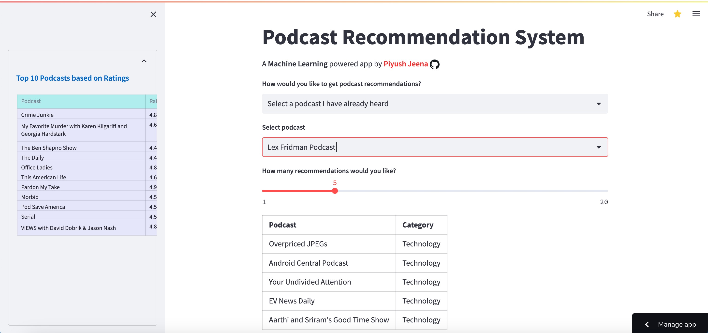

# Apple podcast recommendation system using Tf-IDF and transformers
by Piyush Jeena

APP LINK : [Podcasts Recommendation Engine](https://podcasts-recommendation-system-using-tfidf-and-transformers.streamlit.app)


## Overview 

With the growth of podcasting over the past few years, it becomes increasingly difficult for users to discover new podcasts they may enjoy. Most listeners are cautious or hesitant to try new podcasts since they already have a small number of favorites. Users cannot listen to the first ten seconds or skim through the preview of a podcast, unlike with music or movies, to determine whether they would enjoy it. As a matter of fact, it happened to me while I was looking for french podcasts to learn the language. It might be difficult to match users with podcasts they would like because podcasts are typically lengthy and their topics vary widely. Additionally, due to the sheer volume of podcasts and podcast episodes, it's nearly impossible for users to navigate through them. However, we can potentially aggregate metadata about podcasts and employ various NLP techniques to recommend new, similar podcasts that they may enjoy.

## Data Collection

Data(15000+ podcasts and the metadata) was collected through web scraping from [itunes](https://podcasts.apple.com/us/genre/podcasts/id26) and [Spotify Podcasts dataset](https://podcastsdataset.byspotify.com/).

Example sample data point:
{
  "id" : 'id1434243584,
  "name" : 'Lex Fridman Podcast',
  "url" : 'https://podcasts.apple.com/us/podcast/lex-fridman-podcast/id1434243584',
  "studio" : 'Lex Fridman',
  "category" :"Technology",
  "episode_count" : 300,
  "avg_rating" : 4.8,
  "total_ratings":8300,
  "description":'Conversations about science, technology, history, philosophy and the nature of intelligence, consciousness, love, and power. Lex is an AI researcher at MIT and beyond.'
}


## Data Visualization

Much of the initial exploration of the dataset was done in the notebook **EDA.ipynb** present in the notebooks folder. Since it has ploty visualizations which don't render properly sometimes, one can view the notebook here : [EDA](https://nbviewer.org/github/pjeena/Podcasts-recommender-system-using-sentence-transformers/blob/main/notebooks/EDA.ipynb)

## Modelling

The first step was to  tokenize the podcasts description based on word-embeddings techniques :

### TF_IDF
The word-embeddings were generated based on the 500-600(this can be tuned) most commonly occurring words in the dataset, excluding stopwords.


### Sentence transformer model : [all-* ](https://www.sbert.net/docs/pretrained_models.html)

These models are trained on all available training data (more than 1 billion training pairs) and are designed as general purpose models. This model helps in extracting the semantic similarities from corpus. The embedding generation process is in [model.py](https://github.com/pjeena/Podcasts-recommender-system-using-sentence-transformers/blob/main/src/model.py) under the src folder.


## Recommendations

Cosine-similarity technique was used to recommend new podcasts based on the user input. A user can input query in two ways :

***
* Enter a podcast(for ex Lex Fridman Podcast) which he/she has listened before
* Enter a general theme or description like health, technology and machine learning , climate , language learning etc.

When a user enters a query, an averaged word-embedding vector is generated and compared with the embeddings of the dataset using cosine-similarities to generate similarity scores. The top n(5 , 10 or 20....) podcasts are recommended based on the similarity scores. 


## Model Evaluation

Unlike a supervised learning model, there is no real way of validating the recommendations. Another way could be to formulate a hypothesis that a good embedding would give similarity scores from different categories as less similar compared to podcasts from within a category. The higher tha number of podcasts pairs which satisfy this hypothesis, the better will be the recommendations. The hypothesis can be tested as follows ::

***
* Sample n number of podcasts from each category.
* Choose any two categories, let's say X and Y and calculate the cosine-similarities between every podcast in X with every podcast in Y (similarites across categories), as well as every podcast in  X with the remaining podcasts in X (similarities within a category).
* Compare the **similarites across categories** and **similarities within a category** using a one tailed t-test to verify that the **similarites across categories** is significantly lower than **similarities within a category**.

After performing the above testing, it was observed that approximately 95% of the times, **similarites across categories** were lower than **similarities within a category** which is quite good.


## Deployment

The web UI for the system was done on [Streamlit](https://podcasts-recommendation-system-using-tfidf-and-transformers.streamlit.app/)(app.py in src folder). The model was also deployed on AWS EC2(```Private```). 
 




## Future Work

* Collect more podcast data (include podcast episodes transcriptions)
* Recommend podcast episodes (granular recommendations)
* Try collaborative filtering since the user reviews data is also available
* The recommendation system can be taken to an online learning system since it has two advanatges : quality and scale.


## Authors

* **Piyush Jeena** 

## License

This project is licensed under the MIT License.

## Acknowledgments

* Thanks for reading.


Project Organization
------------

    ├── LICENSE
    ├── Makefile           <- Makefile with commands like `make data` or `make train`
    ├── README.md          <- The top-level README for developers using this project.
    ├── data
    │   ├── external       <- Data from third party sources.
    │   ├── interim        <- Intermediate data that has been transformed.
    │   ├── processed      <- The final, canonical data sets for modeling.
    │   └── raw            <- The original, immutable data dump.
    │
    ├── docs               <- A default Sphinx project; see sphinx-doc.org for details
    │
    ├── models             <- Trained and serialized models, model predictions, or model summaries
    │
    ├── notebooks          <- Jupyter notebooks. Naming convention is a number (for ordering),
    │                         the creator's initials, and a short `-` delimited description, e.g.
    │                         `1.0-jqp-initial-data-exploration`.
    │
    ├── references         <- Data dictionaries, manuals, and all other explanatory materials.
    │
    ├── reports            <- Generated analysis as HTML, PDF, LaTeX, etc.
    │   └── figures        <- Generated graphics and figures to be used in reporting
    │
    ├── requirements.txt   <- The requirements file for reproducing the analysis environment, e.g.
    │                         generated with `pip freeze > requirements.txt`
    │
    ├── setup.py           <- makes project pip installable (pip install -e .) so src can be imported
    ├── src                <- Source code for use in this project.
       ├── __init__.py    <- Makes src a Python module
       │
       |------          <- Scripts for the project : preprocessing, feature engineering, modelling, predictions etc.
      

